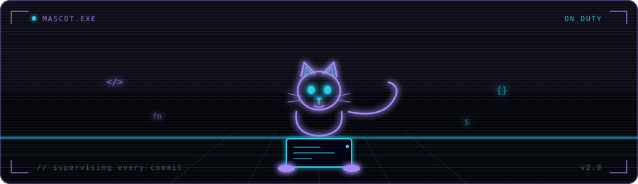

<div align="center">


</div>

---

```
  /\_/\
 ( •ᴗ• )   still shipping...
  > ♥ <
```

I build things — sometimes useful, sometimes just cool. MCA grad from Assam, working independently across mobile, web, and backend. Currently deep into AI tooling and indie SaaS.

When I'm not coding, I'm gaming, editing videos, or convincing myself that *one more side project* is a good idea.

---


## 🛠 Tech I work with

**Languages**


**Frameworks & Tools**


**Currently exploring**


---

## 🐱 Vibe check

<div align="center">
  
</div>

---

## 📊 Stats

<div align="center">
  
</div>

## 🐾 Contribution snake

<div align="center">
  
</div>

---

## 📬 Reach me

[](mailto:rupjyotitalukdar98@gmail.com)
[](https://github.com/MadB0i)

---

<div align="center">
  
</div>
