<div align="center">


<br/>


<br/>

**Indie developer · AI security · shipped to real users**

<sub>MCA grad from Assam, India — building solo across AI agents, security tooling, dev tools and mobile apps.</sub>

<br/>

<a href="https://github.com/MadB0i?tab=repositories">

</a>
<a href="https://github.com/MadB0i/MadB0i">

</a>

</div>



<!-- ══ operator ══ -->

```text
   /\_/\
  ( •ᴗ• )  ▸ status:   SHIPPING
   > ^ <   ▸ stack:    rust · python · typescript · flutter
           ▸ base:     assam, india
           ▸ stacktrace: 99% cat naps, 1% shipping
```

Most of my projects start the same way: **"Wait... why doesn't this already exist?"** — then I lose a few evenings building it.


<!-- ══ featured ══ -->

## 🐾 Featured work

<table>
<tr>
<td width="50%" valign="top">

### [KAVACH](https://github.com/MadB0i/KAVACH)

**Zero-trust execution layer for AI agents** — every tool call is authorized against an explicit default-deny policy and recorded in a tamper-evident audit chain.


</td>
<td width="50%" valign="top">

### [RepoProof](https://github.com/MadB0i/RepoProof)

**Published CLI that audits AI-generated repos** for quality and security risk — deterministic checks, SARIF output, fully local-first.

`npx repoproof`


<br/>
<sub><a href="https://www.npmjs.com/package/repoproof">npm</a> · <a href="https://github.com/MadB0i/RepoProof">source</a></sub>

</td>
</tr>
<tr>
<td width="50%" valign="top">

### [Mission Khaki](https://play.google.com/store/apps/details?id=com.rupjyoti.missionkhaki)

**Free exam-prep app on Google Play** for Army / Assam Police / SSC / CAPF aspirants — full mock tests with real negative marking and in-test English / Hindi / Assamese translation.


<br/>
<sub><a href="https://github.com/MadB0i/Mission_Khaki">site repo</a></sub>

</td>
<td width="50%" valign="top">

### [C.U.R.E](https://github.com/MadB0i/C.U.R.E)

**Clean USB Rescue Engine** — finds how software persists across reboots (Run keys, services, WMI…), attaches evidence to every finding, quarantines but never deletes without consent.


</td>
</tr>
<tr>
<td width="50%" valign="top">

### [KavachBench](https://github.com/MadB0i/KavachBench)

**Research harness behind my first paper (in prep)** — measures Kavach against 42 real prompt-injection attacks from IssueTrojanBench, static analysis plus live baseline-vs-defended agent runs.


</td>
<td width="50%" valign="top">

### [ProbeLab](https://github.com/MadB0i/ProbeLab)

**Local-first environment for evaluating AI agents** — grid-world planning plus protocol adherence inside a deny-by-default capability sandbox. It ships the audit that says how far that currently goes.


</td>
</tr>
</table>

<div align="center">

<sub>Also: <a href="https://github.com/MadB0i/WireSong">WireSong</a> — network traffic as generative soundscape (<a href="https://madb0i.github.io/WireSong/">live demo</a>) · <a href="https://github.com/MadB0i/Pehredar">Pehredar</a> — Android root/spyware detection over ADB · <a href="https://github.com/MadB0i/Ustad">Ustad</a> — local LLM distillation studio · <a href="https://github.com/MadB0i?tab=repositories"><b>→ all repos</b></a></sub>

</div>


<!-- ══ stack ══ -->

## 🐾 Stack

<div align="center">


<br/>

<br/>


</div>


<!-- ══ stats ══ -->

## 🐾 Stats

<div align="center">


<br/>


<br/>

<picture>
  <source media="(prefers-color-scheme: dark)" srcset="https://raw.githubusercontent.com/MadB0i/MadB0i/output/github-contribution-grid-snake-dark.svg" />
  <source media="(prefers-color-scheme: light)" srcset="https://raw.githubusercontent.com/MadB0i/MadB0i/output/github-contribution-grid-snake.svg" />
  
</picture>

</div>


<!-- ══ mascot ══ -->

<div align="center">


</div>

<!-- ══ contact ══ -->

## 🐾 Contact

<div align="center">

<sub>mail me if you're building agent-security or devtool stuff.</sub>

<br/><br/>

<a href="https://github.com/MadB0i">

</a>
<a href="mailto:rupjyotitalukdar98@gmail.com">

</a>

<br/><br/>

<pre>
  /\_/\
 ( ^ᴗ^ )
  > ♥ <
</pre>

<sub>thanks for scrolling this far.</sub>
<sub>cat approves. <a href="https://github.com/MadB0i/MadB0i">star button</a> bhi upar hi hai ↑ — just saying.</sub>

<br/>


<br/><br/>

<sub>probably coding something that wasn't on the roadmap.</sub>

<br/><br/>

**still learning · still building · still shipping**

</div>


